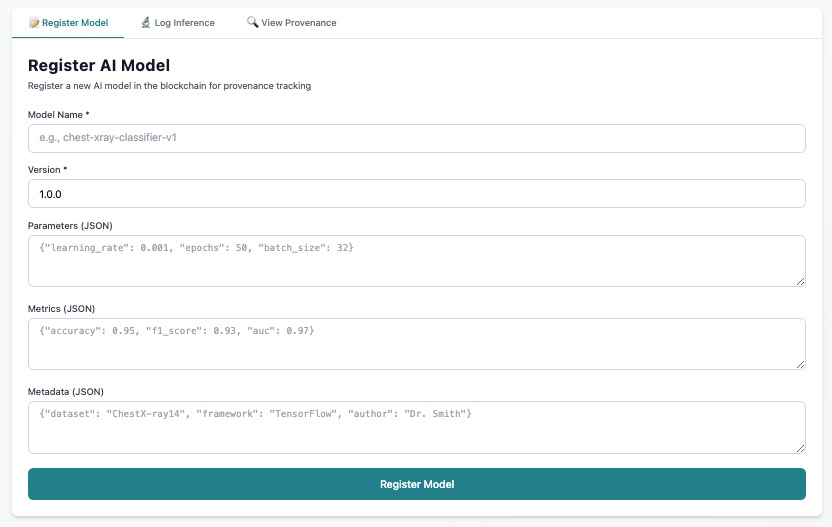
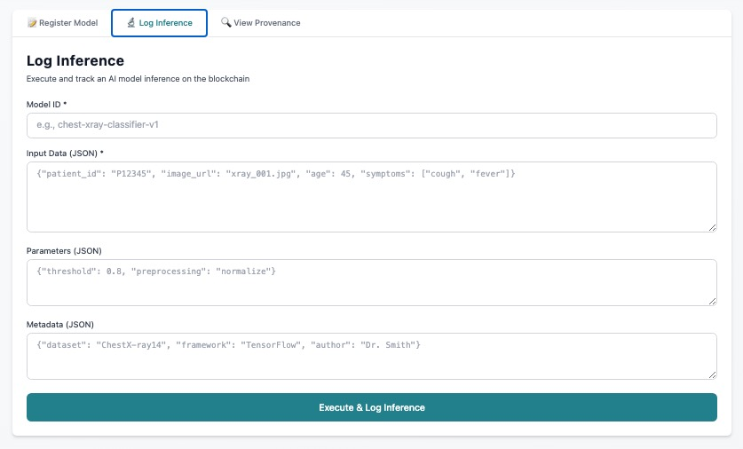
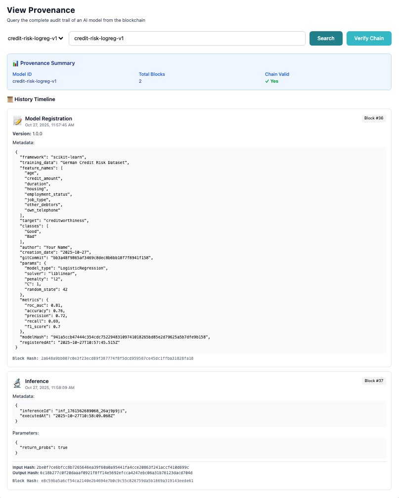
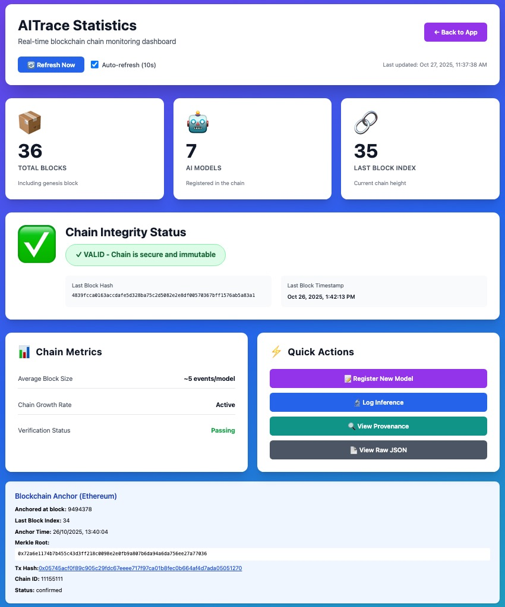

# 🛡️ AI Model Provenance & Auditing PoC - "Ernest"

Welcome to "Ernest", the AI Model Provenance & Auditing Proof-of-Concept—a full-stack platform to **trace, audit, and anchor the lifecycle of AI models and their inferences**.

## 📦 Versions

| Component | Version | Description |
|------------|----------|-------------|
| **PoC "Ernest" (global)** | `0.1.0` | Combined release |
| **Backend (NestJS)** | `0.1.0` | API & integrations |
| **Frontend (Next.js)** | `0.1.0` | UI & client features |

## Why This Project?

In fields like healthcare, finance, and industry, **provenance and transparency for AI models are becoming mission-critical**—not just recommended. Regulations (EU AI Act, FDA, GDPR) and the drive for *trustworthy AI* demand that every decision, model update, and inference can be traced, reproduced, and publicly verified.

## What Does This PoC Offer?

- **Track every model, version, parameter & inference.**
- **Anchor immutable digests (Merkle root) in a public blockchain (Ethereum testnet),** providing tamper-evidence and future-proof proof of existence.
- **Generalist UI & API:** Ready to integrate any model, data type, or business logic—AI-native but extensible to *any provenance use case*.
- **Modern stack:** Fast back-end (NestJS/Node.js + MongoDB), intuitive (React/Next.js) front-end.
- **Auditable & extensible:** Designed for easy adaptation in domains where explainability, compliance, and data lineage matter.

## Who Is This For?

- AI engineers, ML Ops & Data Scientists
- Compliance/Risk officers
- CTOs and product leads exploring **“Responsible AI”**
- Anyone who needs auditable, blockchain-anchored history of AI actions

## Quick Start

1. Clone the repo, install dependencies and launch both backend and frontend.
2. Register your models and submit inferences through the API or web dashboard.
3. Review provenance records, Merkle roots, and blockchain anchors in seconds.

## 🎯 Features

- ✅ **Model Registration**: Register AI models with version control
- ✅ **Inference Tracking**: Log every prediction with input/output hashes (no sensible data is received)
- ✅ **Provenance Querying**: Complete audit trail for any model
- ✅ **Chain Verification**: Cryptographic integrity validation
- ✅ **Immutable History**: Tamper-proof record of all events
- ✅ **Web Dashboard**: User-friendly interface for all operations
- ✅ **CLI **: CLI tool to query hashchain

### Notes

MLFlow is simulated and out of the scope of this PoC. 
In a real integration, Ernest should be integrated from Airflow or MLOps similar tools.

Those inferences inputs and outputs **are not stored in the Database**, only their hashes we receive.    

## Extras

There are some extras that are interesting to complete this PoC:
- a CLI in Go to interact with the MongoDB hashchain.
- a Hardhat project with the solidity "Ernest contract", that will be used to help query the Anchoring events in the Ethereum EVM.
- an AI sandbox with a Python example to train Iris datasets (scikit), and integrated with the NestJs backend.
- a Rust project to build a merkle root calculation library (exportable to wasm)

## Visual demo

### Register AI Model

### Log Inference

### View Provenance

### Hashchain stats

## 🏗️ Architecture

The project follows a **modular architecture** built with **NestJS** for the backend and **Next.js** for the frontend.

## API cURL Examples

For credit risk scoring in banks, a popular model is a Logistic Regression (often starting from open datasets like the German Credit dataset, or via proprietary features), sometimes upgraded to Random Forests or XGBoost ensembles.

Below are two ready-to-use curl examples:
One for registering a credit risk model (let’s assume logistic regression trained on key financial features).

One for logging an inference with feature values for a bank client.

### Register Credit Risk Model

`curl -X POST http://localhost:3001/api/models \
  -H "Content-Type: application/json" \
  -d '{
    "modelId": "credit-risk-logreg-v1",
    "modelName":"Credit Risk logaritmic regression version 1",
    "version": "1.0.0",
    "mlflow": {
      "modelHash": "8caa1ff8cf0eb5080f6fc2c157e53b1a239a2b58075b0cc9ed01215d7ac0dc45",
      "gitCommit": "a3f9d12e6b4c8f72b6f2c1d0ef9a31fcb4dbe7b2"
    },
    "params": {
      "model_type": "LogisticRegression",
      "solver": "liblinear",
      "penalty": "l2",
      "C": 1.0,
      "random_state": 42
    },
    "metrics": {
      "roc_auc": 0.81,
      "accuracy": 0.76,
      "precision": 0.72,
      "recall": 0.69,
      "f1_score": 0.70
    },
    "metadata": {
      "framework": "scikit-learn",
      "training_data": "German Credit Risk Dataset",
      "feature_names": [
        "age", "credit_amount", "duration", "housing", "employment_status", "job_type", "other_debtors", "own_telephone"
      ],
      "target": "creditworthiness",
      "classes": ["Good", "Bad"],
      "author": "Your Name",
      "creation_date": "2025-10-27"
    }
  }'
  `
  Response:
  `{"success":true,"modelId":"credit-risk-logreg-v1","version":"1.0.0","blockIndex":36,"blockHash":"2a648a9bb807c0e3f23ecd89f387774f8f5dcd959587ce45dc1ffba31828fa18","mlflow":{"modelName":"credit-risk-logreg-v1","modelHash":"941a5ccb47444c354cdc75229483109741018265bd85e2d79625a5b7dfe9b158","gitCommit":"bb3a48f9865af3469c8dec8b6bb18f7f8941f158","params":{"model_type":"LogisticRegression","solver":"liblinear","penalty":"l2","C":1,"random_state":42},"metrics":{"roc_auc":0.81,"accuracy":0.76,"precision":0.72,"recall":0.69,"f1_score":0.7},"registeredAt":"2025-10-27T10:57:45.514Z"},"blockchain":{"index":36,"hash":"2a648a9bb807c0e3f23ecd89f387774f8f5dcd959587ce45dc1ffba31828fa18","timestamp":1761562665}}`

### Log Inference 

`curl -X POST http://localhost:3001/api/inferences \
  -H "Content-Type: application/json" \
  -d '{
    "modelId": "credit-risk-logreg-v1",
    "inferenceId": "f61c7b91-2e83-4f4a-8c9b-7c0cb90fca1e",
    "inputHash":"e13236b63f7c5c5c8e7d1d52ebc4188e85f1dc474f0f3b2186e3b061087df6f5",
    "input": {  //not send to Ernest, this is just to give an example
      "age": 34,
      "credit_amount": 12000,
      "duration": 24,
      "housing": "own",
      "employment_status": "permanent",
      "job_type": "skilled",
      "other_debtors": "none",
      "own_telephone": true
    },
    "outputHash":"8caa1ff8cf0eb5080f6fc2c157e53b1a239a2b58075b0cc9ed01215d7ac0dc45",
    "params": {
      "return_probs": true
    },
    "metadata": {
      "scoring_request_id": "score-20251027-1001",
      "source": "branch_app"
    }
  }'
`
Response:
`{"success":true,"inferenceId":"inf_1761562689068_26aj9p9ji","modelId":"credit-risk-logreg-v1","output":{"prediction":"negative","confidence":0.16279536381555004,"timestamp":"2025-10-27T10:58:09.067Z"},"blockIndex":37,"blockHash":"e8c59ba5a6cf54ca2140e2b4694e7b0c9c55c826759da5b1869a319143eede61","hashes":{"input":"2be0f7ce6bfcc8b7265646ea39f60a0a95441fa4cce20863f241accf410d699c","output":"6c18b277c0f20daaaf0921f8ff14e5692efcca4247ebc06a31b76123dacd704d"},"blockchain":{"index":37,"hash":"e8c59ba5a6cf54ca2140e2b4694e7b0c9c55c826759da5b1869a319143eede61","timestamp":1761562689}}`

## 🔒 Security Considerations

⚠️ **This is a POC**. For production:

- [ ] Add authentication (JWT/OAuth)
- [ ] Implement access control (RBAC)
- [ ] Encrypt sensitive data
- [ ] Add digital signatures when registering models and inferences
- [ ] Add rate limiting
- [ ] Use real blockchain (e.g., Hyperledger Fabric/EVM) if several organizations are involved
- [ ] Implement HIPAA compliance
- [ ] Add audit logging
- [ ] Secure API endpoints

## Sepolia smart contract
ErnestMerkleAnchor - 0xb55F5e61102a6f551BffD015998b02bC0688e41D

## 📝 Future Enhancements

- [ ] Real MLflow integration
- [ ] Smart contracts (Solidity)
- [ ] IPFS for large files
- [ ] Multi-party signatures
- [ ] Consensus mechanism 
- [ ] GraphQL API
- [ ] Real-time updates (WebSockets)

## 🤝 Contributing

This is a POC. For improvements:
1. Fork the repo
2. Create feature branch
3. Make changes
4. Test thoroughly
5. Submit PR

## 📄 License

MIT License - free to use and modify

## 👥 Author

Developed and maintained by Carlos Castro Martos.

This project was developed independently by me.

**This repository is not sponsored, endorsed, or licensed by any employer, organization, or company. All code, ideas, and documentation are personal intellectual property and are published for the benefit of the global open source and AI community.**

## 📞 Support

For issues or questions:
- Create GitHub issue
- Check documentation
- Review API endpoints

---

Copyright © 2025 Carlos Castro Martos. Licensed under MIT, see LICENSE.

**Built with ❤️ for medical AI transparency**
