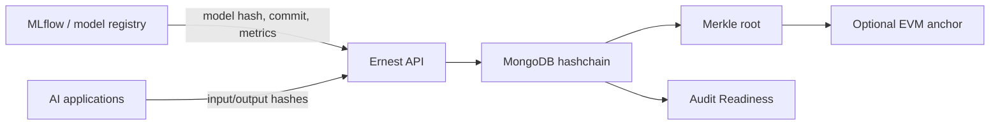
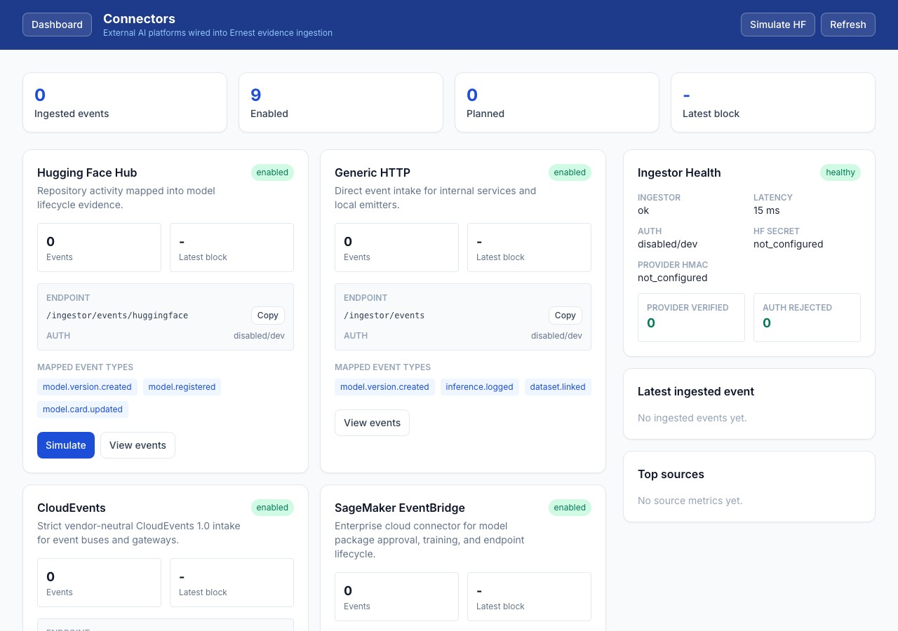

# Ernest: Verifiable AI Provenance

[](https://github.com/ccastromar/ai-blockchain-provenance/actions/workflows/ci.yml)
[](LICENSE)
[](CHANGELOG.md)

AI systems are increasingly asked to prove what happened: which model version was used, which artifact hash was approved, which code commit produced it, whether inference evidence was recorded, and whether the audit trail was later changed.

Most teams already have model registries, ML platforms, application logs, and observability tools. What is often missing is a small, verifiable evidence layer that can sit beside them and answer a narrower question:

> Can this AI lifecycle evidence be independently checked for integrity later?

Ernest is an alpha proof-of-concept for that layer. It stores hashes and metadata, links AI lifecycle events in a local hashchain, verifies the chain, computes Merkle roots, and can optionally anchor those roots to an EVM chain for external proof of existence.

In short: **Ernest is an evidence layer for AI governance, not a replacement for your ML platform.**

## Incubator Pitch

Ernest is aimed at organizations evaluating how to make AI systems more auditable without moving raw model artifacts, prompts, inputs, or outputs into a new central platform. It provides a narrow provenance layer that can sit beside MLflow, model registries, internal AI platforms, business applications, and governance workflows.

The current alpha demonstrates:

- Tamper-evident registration of model lifecycle events.
- Hash-only logging of inference events.
- Local verification through a MongoDB-backed hashchain.
- Optional proof of existence through local Hardhat or Sepolia anchoring.
- MLflow-to-Ernest demo flow for train-to-audit evidence.
- Audit Readiness review for score, missing evidence, and exportable evidence packets.
- A deployable dashboard/API stack suitable for a public PoC or internal pilot.

For an incubation program, the next engineering milestones are enterprise identity, signed client submissions, stronger append serialization, and integrations with real model registries or application event streams.

## Example Use Case

Imagine a bank using a credit-risk model in an internal loan workflow.

Months later, a reviewer asks:

- Which exact model version produced this decision?
- Was the model linked to a known artifact hash and Git commit?
- Were quality metrics and source metadata recorded?
- Were inference input/output hashes logged without storing raw customer data?
- Has the evidence chain been modified since the decision?
- Is there an external timestamp proving this evidence existed at a given time?

MLflow can help with experiment tracking and model registry workflows. Application logs can show operational activity. Ernest focuses on the audit evidence between those systems: hash-only lifecycle records, inference evidence, integrity verification, and optional external anchoring.

## Who Is This For?

- AI governance and model-risk teams evaluating traceability controls.
- Internal AI platform teams building shared auditability infrastructure.
- Banks, insurers, healthcare, pharma, energy, and other regulated-domain teams.
- Security or architecture teams reviewing tamper-evident AI evidence patterns.
- Incubators or research teams exploring verifiable AI lifecycle controls.

## What It Does

- Registers AI models with version, artifact hash, Git commit, parameters, metrics, and metadata.
- Logs inference events using input/output hashes instead of raw sensitive data.
- Stores events in a MongoDB-backed hashchain.
- Verifies block hashes and `previousHash` links.
- Runs an hourly integrity check of the full chain automatically (plus once at startup), records the result, surfaces it in `/health`, and posts to `WEBHOOK_URL` if the chain is found broken — so tampering doesn't require someone to remember to check `/api/verify` manually.
- Computes a Merkle root over hashchain block hashes.
- Optionally anchors the Merkle root to the `ErnestMerkleAnchor` Solidity contract on Sepolia.
- Provides a SvelteKit dashboard with a local audit add-on, NestJS API, Go CLI, Python demo sandbox, and optional auditor agent.

## What Ernest Is Not

- Not a model registry.
- Not an experiment tracker.
- Not an LLM gateway.
- Not a prompt observability platform.
- Not a data lake for raw prompts, inputs, outputs, datasets, or model binaries.
- Not a production compliance system by itself.

Ernest complements those systems by creating a verifiable evidence trail around them.

## Why Not Just MLflow?

| Capability | MLflow | Ernest |
| --- | --- | --- |
| Experiment tracking | Yes | No |
| Model registry | Yes | Integrates |
| Params and metrics | Yes | Stores evidence copies |
| Hash-only inference evidence | No | Yes |
| Tamper-evident event chain | No | Yes |
| Merkle root proofs | No | Yes |
| Optional blockchain anchoring | No | Yes |
| Audit-readiness evidence review | No | Yes |

MLflow is excellent for ML lifecycle tracking. Ernest is narrower: it turns selected lifecycle and inference facts into tamper-evident evidence that can be verified independently of the original tracking system.

## Status

This project is currently `0.1.0-alpha`.

It is suitable for demos, technical evaluation, and research prototypes. It is not a production compliance system. Ernest can support auditability workflows, but it does not by itself provide HIPAA, GDPR, FDA, banking, or enterprise compliance.

## Architecture


```mermaid
flowchart LR
  MLflow["MLflow / model registry"]
  Apps["AI applications"]
  API["Ernest API"]
  Hashchain["MongoDB hashchain"]
  Merkle["Merkle root"]
  Anchor["Optional EVM anchor"]
  Review["Audit Readiness"]

  MLflow -->|"model hash, commit, metrics"| API
  Apps -->|"input/output hashes"| API
  API --> Hashchain
  Hashchain --> Merkle
  Merkle --> Anchor
  Hashchain --> Review
```

More detail: [docs/architecture.md](docs/architecture.md).

## Why Blockchain?

MongoDB plus hashes can show whether the local chain is internally consistent. That is useful, but the proof still lives inside the same operational environment as the application and database.

Optional blockchain anchoring adds an external timestamped commitment:

1. Ernest stores hash-only evidence in MongoDB.
2. Ernest computes a Merkle root over the current chain.
3. Ernest publishes only that root and non-sensitive organizational metadata to an EVM contract.
4. Later, a reviewer can compare local evidence against the anchored root.

This does not put AI data on-chain. It provides a public proof that a specific evidence state existed at a specific time.

For private demos, Ernest can anchor to a local Hardhat chain. For external proof of existence, it can anchor to Sepolia or another EVM network.

## Threat Model

Ernest helps with:

- Detecting modification of stored provenance blocks.
- Detecting broken `previousHash` links in the local hashchain.
- Preserving hash-only evidence without storing sensitive payloads.
- Producing external timestamp evidence through optional anchoring.
- Exporting reviewable evidence packets for audit discussions.

Ernest does not solve by itself:

- Whether the client computed hashes honestly.
- Whether the submitted metadata is truthful.
- Enterprise identity, RBAC, tenant isolation, or approvals.
- Secure custody of production blockchain keys.
- Regulatory compliance without surrounding process and controls.

Planned enterprise controls include signed client submissions, OIDC/JWT auth, RBAC, tenant-aware authorization, and stronger append serialization.

## Components

| Component | Path | Purpose |
| --- | --- | --- |
| Backend | `backend/` | NestJS API, validation, hashchain, anchoring |
| Frontend | `frontend-svelte/` | SvelteKit dashboard and Audit Readiness evidence review |
| Blockchain | `blockchain/` | Hardhat project and Solidity contract |
| CLI | `cli-ernest/` | Go CLI for querying/verifying chain data |
| AI sandbox | `ai-sandbox/` | Iris training/demo integration |
| Auditor | `agentic-auditor/` | Optional FastAPI-based audit agent |
| Integrations | `integrations/` | Adapters for AI/ML tooling such as MLflow |

## Quick Start

Copy environment examples:

```bash
cp .env.example .env
cp backend/.env.example backend/.env
cp frontend-svelte/.env.example frontend-svelte/.env
```

Start the local stack:

```bash
docker compose up --build
```

Then open:

- Dashboard: `http://localhost:3000`
- Backend health: `http://localhost:3001/health`
- API docs: `http://localhost:3001/api/docs`
- Chain stats: `http://localhost:3001/api/stats`
- Event connectors: `http://localhost:3000/connectors`
- Ingested events: `http://localhost:3000/events`
- Local auditor: `http://localhost:3000/auditor`

For a quick product demo, click **Seed demo** on the dashboard. It creates a credit-risk model registration plus two hash-only inference events, then you can open Audit Readiness immediately.

Run a minimal API smoke test:

```bash
./scripts/smoke.sh
```

Run the MLflow-to-Ernest demo:

```bash
./scripts/mlflow-e2e.sh
```

Then open:

- MLflow UI: `http://localhost:8111`
- Audit Readiness: `http://localhost:3000/auditor`

Run the event-ingestion E2E demo:

```bash
EVENT_INGESTOR_API_KEY=<ingestor-key> HF_WEBHOOK_SECRET=<hf-secret> ./scripts/event-connectors-e2e.sh
```

The Docker stack includes Redis, the Go event receiver, and the Go event writer. Events are buffered in Redis Streams, appended to MongoDB `provenanceblocks`, indexed in `ingested_events`, and rejected/DLQ payloads are visible through `event_failures` plus the Events UI.

Run the same stack with a local Hardhat blockchain for anchoring demos:

```bash
cp .env.local-chain.example .env.local-chain
docker compose -f docker-compose.yml -f docker-compose.local-chain.yml --env-file .env.local-chain up -d --build
curl http://localhost:3001/api/anchors/status
curl -X POST http://localhost:3001/api/anchors \
  -H "X-Ernest-Api-Key: <key-if-configured>"
```

For a small public VPS deployment, see [docs/deployment-vps.md](docs/deployment-vps.md).
For a fast evaluator path, see [docs/quick-eval.md](docs/quick-eval.md).
For a company-facing summary, see [docs/incubation-brief.md](docs/incubation-brief.md).
For the documentation map, see [docs/index.md](docs/index.md).

## Local Development

Backend:

```bash
cd backend
pnpm install
pnpm run start:dev
```

Frontend:

```bash
cd frontend-svelte
pnpm install
pnpm run dev
```

Or install all JavaScript workspace dependencies from the repository root:

```bash
pnpm install
```

MongoDB:

```bash
docker run -d -p 27017:27017 --name ernest-mongo mongo:7
```

## API

Main endpoints:

| Method | Path | Purpose |
| --- | --- | --- |
| `GET` | `/health` | Backend health |
| `POST` | `/api/demo/seed` | Seed a ready-to-audit demo evidence packet |
| `POST` | `/api/models` | Register a model and append a hashchain block |
| `POST` | `/api/inferences` | Log an inference and append a hashchain block |
| `GET` | `/api/provenances/:modelId` | Get model provenance |
| `GET` | `/api/provenances/:modelId/export` | Export provenance as a signed JSON bundle |
| `GET` | `/api/provenances/:modelId/export/cyclonedx` | Export provenance as a CycloneDX 1.6 AI/ML-BOM document |
| `GET` | `/api/stats` | Get chain stats and latest anchor |
| `GET` | `/api/verify` | Verify hashchain integrity |
| `GET` | `/api/anchors/status` | Inspect anchoring mode and RPC reachability |
| `POST` | `/api/anchors` | Manually anchor the current Merkle root |
| `GET` | `/api/events` | Query on-chain anchor events |

Request examples and response shapes: [docs/api.md](docs/api.md).
AI tooling integrations: [docs/integrations.md](docs/integrations.md).

When the backend is running, Swagger UI is available at `http://localhost:3001/api/docs` and the OpenAPI document at `http://localhost:3001/api/docs-json`.

## Security

Public demos should set:

```bash
ERNEST_API_KEY=<long-random-secret>
CORS_ORIGIN=https://your-frontend.example
MONGODB_URI=mongodb://<private-host>:27017/ernest
```

When `ERNEST_API_KEY` is set, write endpoints require:

```text
X-Ernest-Api-Key: <long-random-secret>
```

Protected endpoints:

- `POST /api/demo/seed`
- `POST /api/models`
- `POST /api/inferences`
- `POST /api/anchors`

The frontend can send `PUBLIC_ERNEST_API_KEY` for browser-only demos, but that value is public in the built JavaScript bundle. Do not treat it as a production secret.

Security model and limitations: [docs/security-model.md](docs/security-model.md). Responsible disclosure: [SECURITY.md](SECURITY.md).

## Blockchain Anchoring

The local hashchain works without Ethereum credentials. Sepolia anchoring is optional and requires:

```bash
INFURA_URL=https://sepolia.infura.io/v3/...
PRIVATE_KEY=...
CONTRACT_ADDRESS=0xb55F5e61102a6f551BffD015998b02bC0688e41D
ANCHOR_ORGANIZATION_ID=ernest-demo
ANCHOR_ORGANIZATION_NAME="Ernest Demo"
ANCHOR_DOMAIN=ai-provenance
ANCHOR_EVERY_N_BLOCKS=50
```

Manual anchor:

```bash
curl -X POST http://localhost:3001/api/anchors \
  -H "X-Ernest-Api-Key: <key-if-configured>"
```

Deployed Sepolia contract:

```text
ErnestMerkleAnchor: 0xb55F5e61102a6f551BffD015998b02bC0688e41D
```

## FAQ

### Can Ernest run without blockchain?

Yes. The local MongoDB hashchain and integrity verification work without Ethereum credentials. Blockchain anchoring is optional and adds external proof of existence.

### Why store hashes instead of raw AI data?

The goal is to prove that evidence existed and has not changed while keeping prompts, inputs, outputs, datasets, and model binaries in their source systems.

### Why not store everything on-chain?

Cost, privacy, and operational complexity. Ernest anchors compact Merkle roots on-chain and keeps detailed evidence off-chain.

### Does Ernest replace MLflow?

No. MLflow remains useful for experiments and model registry workflows. Ernest can consume selected MLflow metadata and turn it into audit evidence.

### Is Ernest compliant with AI Act, HIPAA, GDPR, or banking regulations?

No standalone tool is compliant by itself. Ernest is an alpha PoC that can support evidence collection, integrity checks, and audit discussions inside a broader governance process.

## Demo Assets

### Register AI Model

Register a model with its version, artifact hash, Git commit, params, metrics, and metadata. Quick-fill lets you pre-populate the form from an already-registered model.


### Log Inference

Log an inference using input/output hashes only — never the raw prompt, input, or output.


### View Provenance

Query the full tamper-evident history for a model, verify the chain, and export it — as a signed JSON bundle or as a CycloneDX 1.6 AI/ML-BOM document that other supply-chain tooling can read directly.


### Hashchain Stats

Live chain health: block count, model count, last block hash, and service status.


### Connectors

The built-in event ingestion connectors, each mapping a provider's native events to Ernest's canonical lifecycle types. See [Market Event Sources](docs/event-ingestion-layer.md#market-event-sources) for the full list and mappings.



## Verification

Useful local checks:

```bash
pnpm run backend:test
pnpm run frontend:check
pnpm run frontend:test
pnpm run frontend:build
pnpm run blockchain:compile
pnpm run audit:prod
cd cli-ernest && go test ./cmd/... ./internal/db/repositories/...
python -m compileall ai-sandbox/domains/iris agentic-auditor/app
bash -n scripts/smoke.sh scripts/deploy-check.sh setup.sh
./scripts/deploy-check.sh
```

Release checklist: [docs/release-checklist.md](docs/release-checklist.md).
Dependency risk policy: [docs/dependency-risk.md](docs/dependency-risk.md).
Backup and recovery: [docs/backup-recovery.md](docs/backup-recovery.md).

## Roadmap

- Enterprise identity integration.
- Signed client submissions.
- In-product MLflow import UI and signed integration submissions.
- User authentication and RBAC.
- Digital signatures for model and inference events.
- AI Act evidence mapping and policy-control checklists.
- Standards alignment with W3C PROV, OpenLineage, and OpenTelemetry-style event streams.
- ✅ CycloneDX 1.6 AI/ML-BOM export (`/api/provenances/:modelId/export/cyclonedx`), so provenance evidence can be read by tools that already speak CycloneDX (dependency-track, GUAC, etc.) without a custom integration. In-toto/SLSA provenance attestations are a natural next export format on the same data.
- IPFS or object-store references for large artifacts.
- Stronger production deployment patterns.
- Multi-party verification flows.
- Real-time updates.

## Contributing

This is an alpha PoC. Issues and pull requests are welcome.

Before proposing a release, check:

- [CHANGELOG.md](CHANGELOG.md)
- [docs/release-checklist.md](docs/release-checklist.md)
- [SECURITY.md](SECURITY.md)

## License

MIT License. See [LICENSE](LICENSE).

## Author

Developed and maintained by Carlos Castro Martos.

This project was developed independently. It is not sponsored, endorsed, or licensed by any employer, organization, or company.
