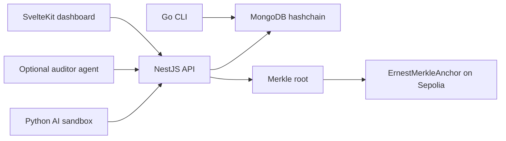
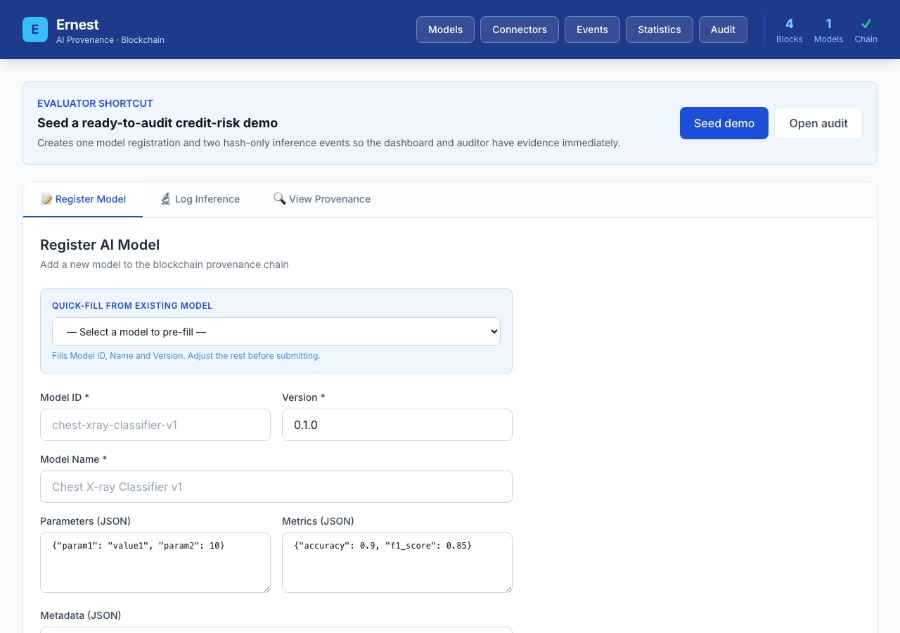
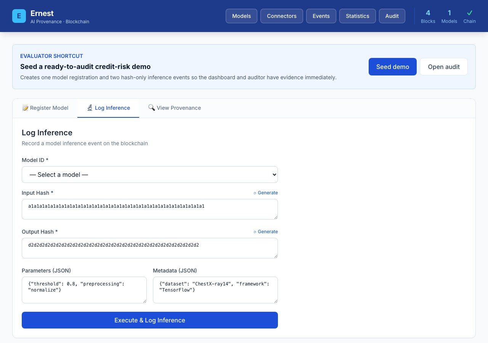
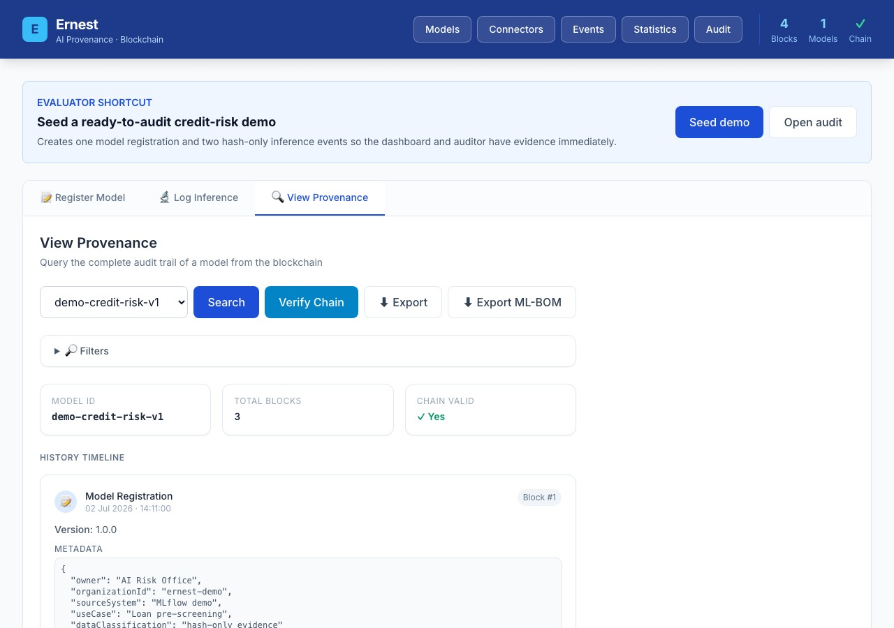
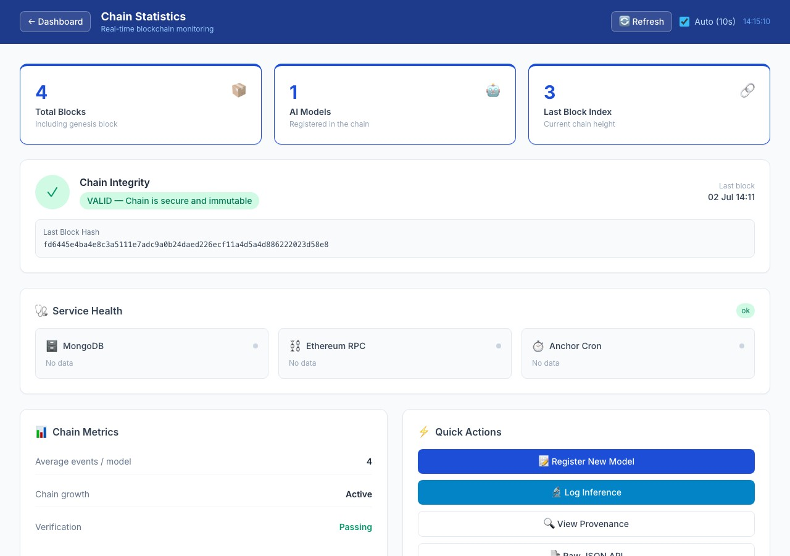

# Ernest: AI Provenance and Blockchain Anchoring PoC

[](https://github.com/ccastromar/ai-blockchain-provenance/actions/workflows/ci.yml)
[](LICENSE)
[](CHANGELOG.md)

Ernest is a proof-of-concept platform for tracing AI model lifecycle events and inference records through a local hashchain, then optionally anchoring Merkle roots to an Ethereum-compatible public testnet.

The core idea is simple: store only provenance metadata and hashes, verify that the local event chain has not been tampered with, and publish periodic proofs of existence on-chain.

## Incubator Pitch

Ernest is aimed at organizations evaluating how to make AI systems more auditable without moving raw model artifacts, prompts, inputs, or outputs into a new central platform. It provides a narrow provenance layer that can sit beside existing ML platforms and business applications.

The current alpha demonstrates:

- Tamper-evident registration of model lifecycle events.
- Hash-only logging of inference events.
- Local verification through a MongoDB-backed hashchain.
- Optional public proof of existence through Sepolia anchoring.
- A deployable dashboard/API stack suitable for a public PoC or internal pilot.

For an incubation program, the next engineering milestones are enterprise identity, signed client submissions, stronger append serialization, and integrations with real model registries or application event streams.

## What It Does

- Registers AI models with version, artifact hash, Git commit, parameters, metrics, and metadata.
- Logs inference events using input/output hashes instead of raw sensitive data.
- Stores events in a MongoDB-backed hashchain.
- Verifies block hashes and `previousHash` links.
- Computes a Merkle root over hashchain block hashes.
- Optionally anchors the Merkle root to the `ErnestMerkleAnchor` Solidity contract on Sepolia.
- Provides a SvelteKit dashboard with a local audit add-on, NestJS API, Go CLI, Rust/WASM Merkle helper, Python demo sandbox, and optional auditor agent.

## Status

This project is currently `0.1.0-alpha`.

It is suitable for demos, technical evaluation, and research prototypes. It is not a production compliance system. Ernest can support auditability workflows, but it does not by itself provide HIPAA, GDPR, FDA, banking, or enterprise compliance.

## Architecture


```mermaid
flowchart LR
  UI["SvelteKit dashboard"] --> API["NestJS API"]
  CLI["Go CLI"] --> Mongo["MongoDB hashchain"]
  API --> Mongo
  API --> Merkle["Merkle root"]
  Merkle --> Contract["ErnestMerkleAnchor on Sepolia"]
  Auditor["Optional auditor agent"] --> API
  Sandbox["Python AI sandbox"] --> API
```

More detail: [docs/architecture.md](docs/architecture.md).

## Components

| Component | Path | Purpose |
| --- | --- | --- |
| Backend | `backend/` | NestJS API, validation, hashchain, anchoring |
| Frontend | `frontend-svelte/` | SvelteKit dashboard and local WebLLM auditor add-on |
| Legacy frontend | `frontend/` | Deprecated Next.js dashboard |
| Blockchain | `blockchain/` | Hardhat project and Solidity contract |
| CLI | `cli-ernest/` | Go CLI for querying/verifying chain data |
| Merkle WASM | `merkle-wasm/` | Rust Merkle helper |
| AI sandbox | `ai-sandbox/` | Iris training/demo integration |
| Auditor | `agentic-auditor/` | Optional FastAPI-based audit agent |
| Integrations | `integrations/` | Adapters for AI/ML tooling such as MLflow |

## Quick Start

Copy environment examples:

```bash
cp .env.example .env
cp backend/.env.example backend/.env
cp frontend-svelte/.env.example frontend-svelte/.env
```

Start the local stack:

```bash
docker compose up --build
```

Then open:

- Dashboard: `http://localhost:3000`
- Backend health: `http://localhost:3001/health`
- API docs: `http://localhost:3001/api/docs`
- Chain stats: `http://localhost:3001/api/stats`
- Local auditor: `http://localhost:3000/auditor`

Run a minimal API smoke test:

```bash
./scripts/smoke.sh
```

Run the same stack with a local Hardhat blockchain for anchoring demos:

```bash
cp .env.local-chain.example .env.local-chain
docker compose -f docker-compose.yml -f docker-compose.local-chain.yml --env-file .env.local-chain up -d --build
curl http://localhost:3001/api/anchors/status
curl -X POST http://localhost:3001/api/anchors \
  -H "X-Ernest-Api-Key: <key-if-configured>"
```

For a small public VPS deployment, see [docs/deployment-vps.md](docs/deployment-vps.md).
For a fast evaluator path, see [docs/quick-eval.md](docs/quick-eval.md).
For a company-facing summary, see [docs/incubation-brief.md](docs/incubation-brief.md).
For the documentation map, see [docs/index.md](docs/index.md).

## Local Development

Backend:

```bash
cd backend
pnpm install
pnpm run start:dev
```

Frontend:

```bash
cd frontend-svelte
pnpm install
pnpm run dev
```

Or install all JavaScript workspace dependencies from the repository root:

```bash
pnpm install
```

MongoDB:

```bash
docker run -d -p 27017:27017 --name ernest-mongo mongo:7
```

## API

Main endpoints:

| Method | Path | Purpose |
| --- | --- | --- |
| `GET` | `/health` | Backend health |
| `POST` | `/api/models` | Register a model and append a hashchain block |
| `POST` | `/api/inferences` | Log an inference and append a hashchain block |
| `GET` | `/api/provenances/:modelId` | Get model provenance |
| `GET` | `/api/stats` | Get chain stats and latest anchor |
| `GET` | `/api/verify` | Verify hashchain integrity |
| `GET` | `/api/anchors/status` | Inspect anchoring mode and RPC reachability |
| `POST` | `/api/anchors` | Manually anchor the current Merkle root |
| `GET` | `/api/events` | Query on-chain anchor events |

Request examples and response shapes: [docs/api.md](docs/api.md).
AI tooling integrations: [docs/integrations.md](docs/integrations.md).

When the backend is running, Swagger UI is available at `http://localhost:3001/api/docs` and the OpenAPI document at `http://localhost:3001/api/docs-json`.

## Security

Public demos should set:

```bash
ERNEST_API_KEY=<long-random-secret>
CORS_ORIGIN=https://your-frontend.example
MONGODB_URI=mongodb://<private-host>:27017/ernest
```

When `ERNEST_API_KEY` is set, write endpoints require:

```text
X-Ernest-Api-Key: <long-random-secret>
```

Protected endpoints:

- `POST /api/models`
- `POST /api/inferences`
- `POST /api/anchors`

The frontend can send `PUBLIC_ERNEST_API_KEY` for browser-only demos, but that value is public in the built JavaScript bundle. Do not treat it as a production secret.

Security model and limitations: [docs/security-model.md](docs/security-model.md). Responsible disclosure: [SECURITY.md](SECURITY.md).

## Blockchain Anchoring

The local hashchain works without Ethereum credentials. Sepolia anchoring is optional and requires:

```bash
INFURA_URL=https://sepolia.infura.io/v3/...
PRIVATE_KEY=...
CONTRACT_ADDRESS=0xb55F5e61102a6f551BffD015998b02bC0688e41D
ANCHOR_ORGANIZATION_ID=ernest-demo
ANCHOR_ORGANIZATION_NAME="Ernest Demo"
ANCHOR_DOMAIN=ai-provenance
ANCHOR_EVERY_N_BLOCKS=50
```

Manual anchor:

```bash
curl -X POST http://localhost:3001/api/anchors \
  -H "X-Ernest-Api-Key: <key-if-configured>"
```

Deployed Sepolia contract:

```text
ErnestMerkleAnchor: 0xb55F5e61102a6f551BffD015998b02bC0688e41D
```

## Demo Assets

### Register AI Model



### Log Inference



### View Provenance



### Hashchain Stats



## Verification

Useful local checks:

```bash
pnpm run backend:test
pnpm run frontend:check
pnpm run frontend:build
pnpm run blockchain:compile
pnpm run audit:prod
cd cli-ernest && go test ./cmd/... ./internal/db/repositories/...
cd merkle-wasm && cargo test
python -m compileall ai-sandbox/domains/iris agentic-auditor/app
bash -n scripts/smoke.sh scripts/deploy-check.sh setup.sh
./scripts/deploy-check.sh
```

Release checklist: [docs/release-checklist.md](docs/release-checklist.md).
Dependency risk policy: [docs/dependency-risk.md](docs/dependency-risk.md).

## Roadmap

- Enterprise identity integration.
- Signed client submissions.
- Real MLflow integration.
- User authentication and RBAC.
- Digital signatures for model and inference events.
- IPFS or object-store references for large artifacts.
- Stronger production deployment patterns.
- Multi-party verification flows.
- Real-time updates.

## Contributing

This is an alpha PoC. Issues and pull requests are welcome.

Before proposing a release, check:

- [CHANGELOG.md](CHANGELOG.md)
- [docs/release-checklist.md](docs/release-checklist.md)
- [SECURITY.md](SECURITY.md)

## License

MIT License. See [LICENSE](LICENSE).

## Author

Developed and maintained by Carlos Castro Martos.

This project was developed independently. It is not sponsored, endorsed, or licensed by any employer, organization, or company.
