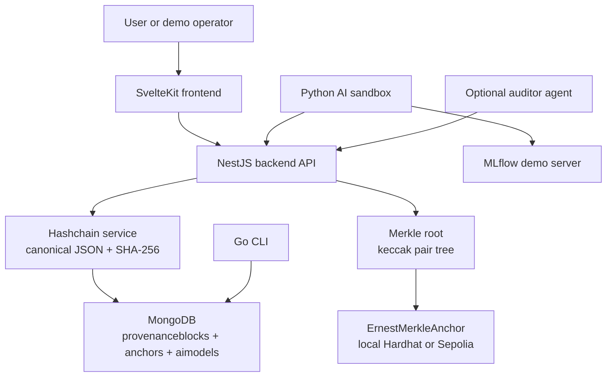
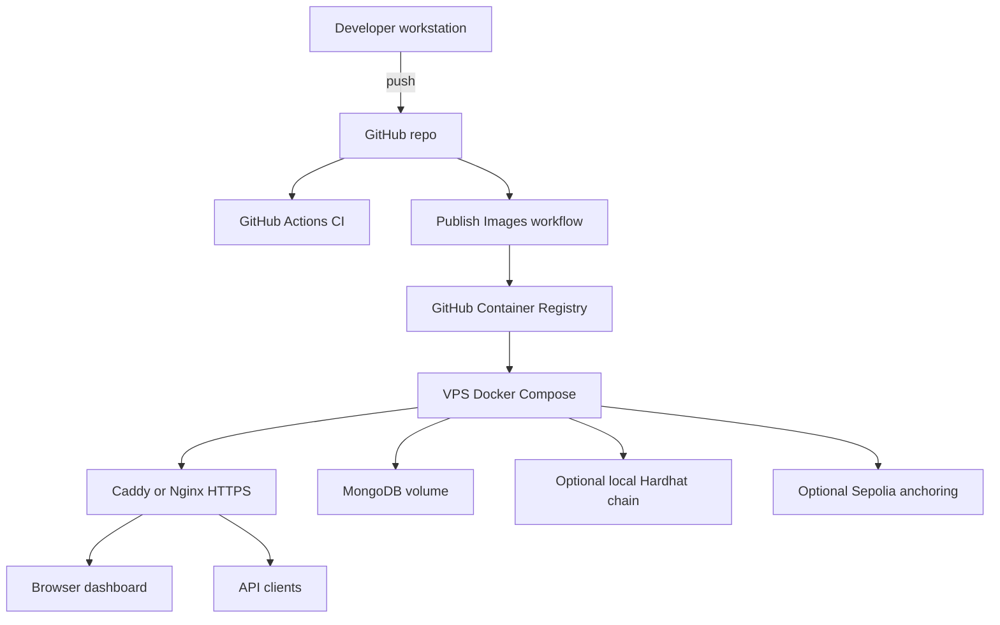
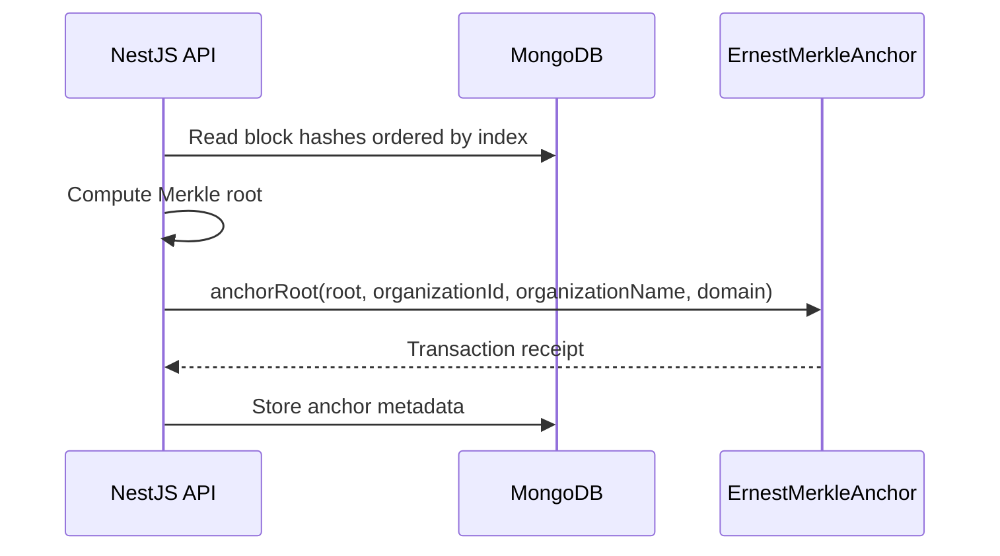
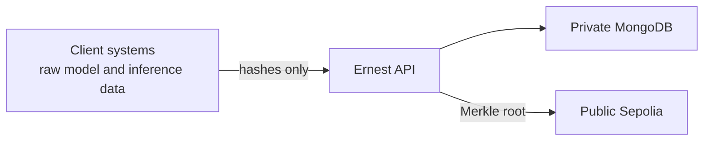

# Architecture

Ernest is a modular proof-of-concept for AI provenance. The default stack uses a SvelteKit dashboard, a NestJS API, MongoDB for local hashchain storage, and optional EVM anchoring through either a local Hardhat chain or Sepolia.

The design intentionally separates the provenance control plane from raw AI data. Ernest records hashes, model metadata, and audit-oriented events; source systems remain responsible for raw prompts, inference payloads, training data, model binaries, access control, and retention policies.

## System View

## Deployment View

The repository supports two deployment modes:

- Local build mode: `docker compose up --build` builds backend and frontend images on the target host.
- Prebuilt image mode: `docker-compose.prod.yml` pulls backend and frontend images from GHCR and starts the stack with Docker Compose.
- Local anchoring mode: `docker-compose.local-chain.yml` adds a Hardhat RPC service and one-shot contract deployment for self-contained demos.
- MLflow demo mode: `docker-compose.mlflow.yml` adds an MLflow server and one-shot Iris training job that registers model and inference evidence in Ernest.

Prebuilt image mode is preferred for repeatable demos because the running server does not need to compile JavaScript dependencies.

## Core Flow

1. A model registration or inference event is submitted to the backend.
2. The backend validates payload shape and hashes.
3. The `BlockchainService` canonicalizes event data.
4. A new block is appended with:
   - sequential `index`
   - Unix timestamp
   - event `data`
   - `previousHash`
   - SHA-256 block hash
5. MongoDB stores the block with unique indexes on `index` and `hash`.
6. Verification recomputes every block hash and checks every `previousHash` link.

## Anchoring Flow

Anchoring is optional. If `INFURA_URL`, `PRIVATE_KEY`, and `CONTRACT_ADDRESS` are not configured, the local hashchain still works. `GET /api/anchors/status` reports whether the backend is disabled, connected to the local chain, or configured for Sepolia/custom RPC.

## Data Stored

Ernest stores model and inference metadata plus hashes. It should not receive raw inference inputs or outputs.

For inference events, the intended pattern is:

- Client computes `inputHash` from raw input outside Ernest.
- Client computes `outputHash` from raw output outside Ernest.
- Ernest stores only hashes, parameters, and metadata.

## Concurrency Model

Appending a hashchain block is a read-last-block, calculate-next-block, insert operation. The implementation protects this with:

- Unique MongoDB indexes on `index` and `hash`.
- Retry handling for duplicate-key races.
- `409 Conflict` if append retries are exhausted.

This is sufficient for a PoC and low-throughput demo. A production implementation should consider stronger append serialization, transactions, or a dedicated event log.

## Trust Boundaries

Ernest verifies integrity of records it receives. It does not prove that the original raw data was correct unless clients compute and manage hashes honestly.

## Optional Components

- `cli-ernest`: direct MongoDB querying and verification utilities.
- `agentic-auditor`: FastAPI-based assistant for querying Ernest and summarizing audit data.
- `ai-sandbox`: sample Iris model training and registration workflow.
- `merkle-wasm`: Rust implementation for Merkle/hash utilities.

These are useful for demos and experiments, but the core stack is backend, frontend, MongoDB, and optional Sepolia anchoring.

## Enterprise Integration Points

- Model registry: map `modelId`, version, artifact hash, and Git commit from MLflow, SageMaker, Vertex AI, Azure ML, or an internal registry.
- Inference systems: compute `inputHash` and `outputHash` at the application boundary and submit only hashes plus non-sensitive metadata.
- Identity layer: replace the alpha API key with OIDC/JWT, mTLS, or an API gateway policy.
- Evidence export: use provenance and anchor endpoints to feed audit reports, GRC workflows, or internal compliance review.
- Key management: move Sepolia or future mainnet private keys to a managed secrets system.

## Design Trade-Offs

| Choice | Benefit | Trade-off |
| --- | --- | --- |
| Hash-only event payloads | Avoids centralizing sensitive inference data | Ernest cannot prove the original raw data was hashed honestly |
| MongoDB hashchain | Simple to inspect, query, and demo | High-throughput production use needs stronger serialization |
| Optional public anchoring | External proof of existence without storing data on-chain | Requires RPC credentials and wallet operations |
| Static SvelteKit frontend | Small deployable dashboard image | Runtime API URL changes should use same-origin proxying |
| API key protection | Easy public PoC hardening | Not sufficient for enterprise identity and authorization |

## Incubation Roadmap

1. Replace API key demos with enterprise identity and role-based authorization.
2. Add signed client submissions so Ernest can verify which system produced each hash.
3. Add stronger append serialization for higher write throughput.
4. Integrate with a real model registry and one production-like inference event source.
5. Add operational metrics, audit logs for write attempts, and backup validation.
6. Package evidence exports for compliance or model-risk review workflows.
