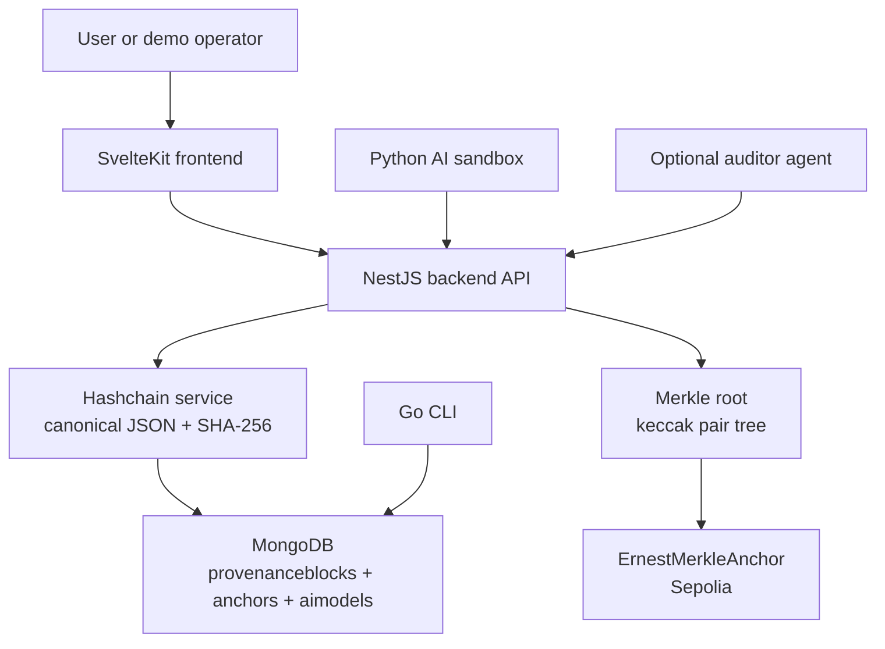
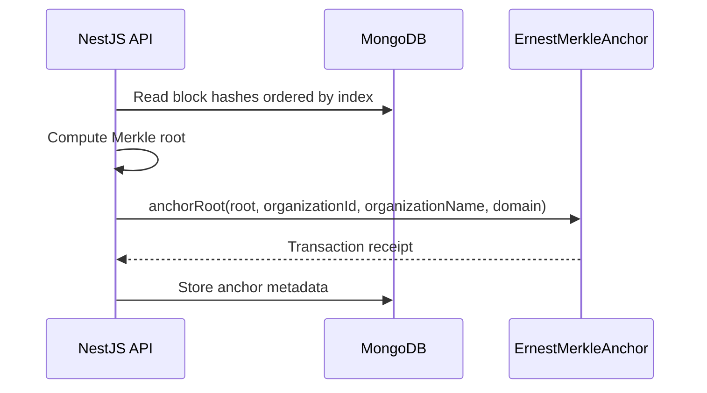
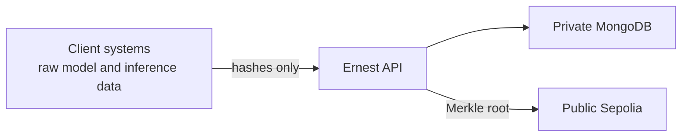

# Architecture

Ernest is a modular proof-of-concept for AI provenance. The default stack uses a SvelteKit dashboard, a NestJS API, MongoDB for local hashchain storage, and an optional Sepolia smart contract for public anchoring.

## System View

## Core Flow

1. A model registration or inference event is submitted to the backend.
2. The backend validates payload shape and hashes.
3. The `BlockchainService` canonicalizes event data.
4. A new block is appended with:
   - sequential `index`
   - Unix timestamp
   - event `data`
   - `previousHash`
   - SHA-256 block hash
5. MongoDB stores the block with unique indexes on `index` and `hash`.
6. Verification recomputes every block hash and checks every `previousHash` link.

## Anchoring Flow

Anchoring is optional. If `INFURA_URL`, `PRIVATE_KEY`, and `CONTRACT_ADDRESS` are not configured, the local hashchain still works.

## Data Stored

Ernest stores model and inference metadata plus hashes. It should not receive raw inference inputs or outputs.

For inference events, the intended pattern is:

- Client computes `inputHash` from raw input outside Ernest.
- Client computes `outputHash` from raw output outside Ernest.
- Ernest stores only hashes, parameters, and metadata.

## Concurrency Model

Appending a hashchain block is a read-last-block, calculate-next-block, insert operation. The implementation protects this with:

- Unique MongoDB indexes on `index` and `hash`.
- Retry handling for duplicate-key races.
- `409 Conflict` if append retries are exhausted.

This is sufficient for a PoC and low-throughput demo. A production implementation should consider stronger append serialization, transactions, or a dedicated event log.

## Trust Boundaries

Ernest verifies integrity of records it receives. It does not prove that the original raw data was correct unless clients compute and manage hashes honestly.

## Optional Components

- `cli-ernest`: direct MongoDB querying and verification utilities.
- `agentic-auditor`: FastAPI-based assistant for querying Ernest and summarizing audit data.
- `ai-sandbox`: sample Iris model training and registration workflow.
- `merkle-wasm`: Rust implementation for Merkle/hash utilities.

These are useful for demos and experiments, but the core stack is backend, frontend, MongoDB, and optional Sepolia anchoring.
