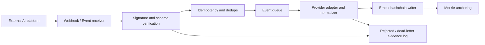

# Ernest Event Ingestion Layer

This document captures the proposed next layer for Ernest beyond the current HTTP API: an event ingestion layer that can consume lifecycle, governance, and inference events from AI platforms already used in the market.

## Product Direction

Ernest should evolve from a manually called provenance API into a verifiable evidence ingestion layer for AI and ML systems.

The current API remains useful, but the next product layer should listen to events emitted by model registries, cloud ML platforms, LLM observability tools, lineage systems, and production applications. Ernest can then normalize those events, hash the relevant evidence, append them to the hashchain, and optionally anchor Merkle roots externally.

The core positioning remains:

- Ernest is not a model registry.
- Ernest is not an observability platform.
- Ernest is not a raw prompt, dataset, or model artifact store.
- Ernest is a tamper-evident evidence layer beside those systems.

## Proposed Layer

Working name:

- Ernest Event Mesh
- Ernest Evidence Ingestion Layer
- Ernest Event Gateway

The layer should accept events from different sources, map them to a canonical Ernest event model, verify authenticity where possible, deduplicate them, and append valid evidence events to the existing provenance hashchain.

High-level flow:



## New API Surface

Keep the current endpoints:

- `POST /api/models`
- `POST /api/inferences`
- `GET /api/provenances/:modelId`
- `GET /api/verify`
- `POST /api/anchors`

Add a generic event endpoint:

- `POST /api/events`

Potential payload shape:

```json
{
  "eventType": "model.registered",
  "source": "sagemaker",
  "sourceEventId": "external-event-id",
  "occurredAt": "2026-06-29T10:00:00Z",
  "subject": {
    "modelId": "credit-risk-logreg",
    "version": "3",
    "artifactUri": "s3://bucket/models/credit-risk/3",
    "artifactHash": "sha256..."
  },
  "actor": {
    "type": "service-account",
    "id": "sagemaker-pipeline-role"
  },
  "evidence": {
    "datasetHash": "sha256...",
    "codeCommit": "abcdef1234567890",
    "inputHash": "sha256...",
    "outputHash": "sha256..."
  },
  "rawEventHash": "sha256...",
  "metadata": {}
}
```

## Canonical Event Types

Suggested Ernest event taxonomy:

- `model.registered`
- `model.version.created`
- `model.approved`
- `model.rejected`
- `model.deprecated`
- `model.deployed`
- `model.undeployed`
- `model.card.updated`
- `training.started`
- `training.completed`
- `dataset.linked`
- `evaluation.logged`
- `inference.logged`
- `drift.detected`
- `policy.reviewed`
- `anchor.created`

These should map to the current hashchain event model without requiring Ernest to store raw model artifacts, raw prompts, raw inference inputs, or raw outputs.

## Standards To Support

### CloudEvents

CloudEvents can be used as the event envelope for interoperability across systems. Ernest now treats `/events/cloudevents` as a strict CloudEvents 1.0 intake: `specversion`, `id`, `source`, and `type` are required, and invalid envelopes are rejected into the failure log instead of being silently normalized as generic JSON.

Example:

```json
{
  "specversion": "1.0",
  "type": "com.ernest.model.deployed",
  "source": "aws.sagemaker",
  "id": "eventbridge-id",
  "time": "2026-06-29T10:00:00Z",
  "subject": "model/credit-risk/version/3",
  "datacontenttype": "application/json",
  "data": {}
}
```

Reference: https://github.com/cloudevents/spec/blob/main/cloudevents/spec.md

### OpenLineage

OpenLineage is useful for training and data provenance. Ernest can consume OpenLineage run, job, and dataset events, then notarize selected hashes and metadata.

Reference: https://openlineage.io/docs/spec/object-model/

### OpenTelemetry

OpenTelemetry can be useful for production inference and application-level AI events. Ernest could support an OTLP-style collector or exporter path so applications can emit inference evidence through existing observability infrastructure.

Reference: https://opentelemetry.io/docs/specs/otel/logs/data-model/

## Market Event Sources

### AWS SageMaker

AWS SageMaker emits events through EventBridge for model and ML lifecycle activity.

Relevant event families include:

- Model package state changes
- Model state changes
- Training job state changes
- Endpoint state changes
- Model card state changes
- Pipeline execution state changes
- Processing job state changes

Reference: https://docs.aws.amazon.com/sagemaker/latest/dg/automating-sagemaker-with-eventbridge.html

### Azure Machine Learning

Azure ML integrates with Event Grid and can emit events such as:

- Model registered
- Model deployed
- Run completed
- Run status changed
- Dataset drift detected

Reference: https://learn.microsoft.com/en-us/azure/machine-learning/how-to-use-event-grid?view=azureml-api-2

### Google Vertex AI

Vertex AI exposes audit logs through Google Cloud logging. Those logs can be routed to Pub/Sub and transformed into Ernest events.

Relevant operations include model upload, endpoint deployment, dataset creation, and custom job execution.

Reference: https://cloud.google.com/vertex-ai/docs/general/audit-logging

### Hugging Face Hub

Hugging Face Hub webhooks can report repository activity such as commits, refs, pull requests, discussions, and tag updates. This is useful for tracking open-source model artifact changes and source references.

Reference: https://huggingface.co/docs/hub/webhooks

### Databricks / Unity Catalog

Databricks manages registered models, model versions, permissions, aliases, and lifecycle transitions through Unity Catalog. A connector could poll or subscribe indirectly to changes and submit evidence to Ernest.

Reference: https://docs.databricks.com/aws/en/machine-learning/manage-model-lifecycle/

## Recommended Connectors

Suggested implementation order:

1. Hugging Face webhook connector
2. SageMaker EventBridge connector
3. OpenLineage ingestion
4. OpenTelemetry / OTLP inference collector
5. Azure ML Event Grid connector
6. Databricks / Unity Catalog connector
7. Vertex AI audit-log-to-Pub/Sub connector

The first implemented connectors are Hugging Face, SageMaker, OpenLineage, OpenTelemetry, and Azure ML. Hugging Face is useful for public model repository demos, SageMaker and Azure ML are enterprise cloud proof points, OpenLineage adds training and dataset lineage evidence, and OpenTelemetry lets production applications submit hash-only inference evidence through observability pipelines.

## Trust And Security Controls

The ingestion layer should not blindly trust external JSON.

Recommended controls:

- HMAC verification for webhooks.
- Optional ingestor shared-secret authentication via `EVENT_INGESTOR_API_KEY` and `X-Ernest-Ingest-Key`.
- Ed25519 or JWS signatures for client-submitted evidence.
- mTLS or API gateway authentication for enterprise deployments.
- Source allowlist by provider and tenant.
- Idempotency using `source`, `sourceEventId`, and `eventType`.
- Raw event hashing before transformation.
- Canonical payload hashing after normalization.
- Signature verification status stored as metadata.
- Rejected event log for auditability.

This aligns with the existing Ernest roadmap item for signed client submissions.

Current implementation note:

- If `EVENT_INGESTOR_API_KEY` is empty, local/dev ingestion remains open and emitted evidence is tagged with `metadata.verificationStatus = "unverified"`.
- If `EVENT_INGESTOR_API_KEY` is set, `/events`, `/events/cloudevents`, `/events/huggingface`, and `/events/sagemaker` require `X-Ernest-Ingest-Key`.
- Authenticated generic/SageMaker evidence is tagged with `metadata.verificationStatus = "shared_secret"` and `metadata.verificationMethod = "X-Ernest-Ingest-Key"`.
- If `HF_WEBHOOK_SECRET` is set and a Hugging Face event includes a valid `X-Webhook-Secret`, evidence is upgraded to `metadata.verificationStatus = "provider_secret"` and `metadata.verificationMethod = "X-Webhook-Secret"`.
- Frontend simulations call the backend ingestor proxy; the backend injects `X-Ernest-Ingest-Key` server-side so the shared secret is not compiled into browser assets.
- Auth and provider verification rejections are written to `ernest:events:rejected`; the writer persists them in `event_failures` with `failureKind = "auth_rejected"` and `authFailureType` such as `ingestor_api_key` or `provider_secret`.
- Successful ingested events persist `verificationStatus`, `verificationMethod`, and `transportAuth` as top-level fields in `ingested_events`, so the backend and UI can filter and group by verification state without reading the linked hashchain block.

Implemented environment variables:

| Variable | Used by | Default | Purpose |
| --- | --- | --- | --- |
| `EVENT_INGESTOR_URL` | Backend | `http://localhost:3011` locally, `http://event-ingestor:3011` in Docker | Backend proxy target for ingestor simulations and health. |
| `EVENT_INGESTOR_API_KEY` | Backend, ingestor | empty | Optional shared secret required as `X-Ernest-Ingest-Key` when configured. |
| `HF_WEBHOOK_SECRET` | Backend, ingestor | empty | Optional Hugging Face webhook secret required as `X-Webhook-Secret` when configured. |
| `REDIS_ADDR` | Ingestor, writer | `redis:6379` | Redis connection address. |
| `REDIS_STREAM` | Ingestor, writer | `ernest:events:incoming` | Incoming accepted event stream. |
| `REDIS_STREAM_MAXLEN` | Ingestor | `10000` | Approximate max length for accepted events. |
| `REDIS_GROUP` | Writer | `provenance-writers` | Redis consumer group. |
| `REDIS_CONSUMER` | Writer | host-derived | Redis consumer name. |
| `REDIS_DLQ_STREAM` | Writer | `ernest:events:deadletter` | Failed normalization/write stream. |
| `REDIS_REJECTED_STREAM` | Ingestor, writer | `ernest:events:rejected` | Auth/provider verification rejection stream. |
| `WORKER_BATCH_COUNT` | Writer | `10` | Max Redis messages read per worker cycle. |
| `WORKER_BLOCK_MS` | Writer | `5000` | Redis blocking read timeout. |
| `MAX_PAYLOAD_BYTES` | Ingestor | `1048576` | Max accepted HTTP payload size. |

The frontend must not receive `EVENT_INGESTOR_API_KEY` or `HF_WEBHOOK_SECRET`. Browser actions call the NestJS backend proxy, and the backend injects secrets server-side.

## Storage Additions

Potential new collections:

- `ingested_events`: raw event hash, source, source event ID, status, timestamps.
- `event_adapters`: provider configuration and enabled event types.
- `event_failures`: rejected events and validation errors.

The hashchain should continue to store canonical, non-sensitive evidence.

## Implementation Sketch

Backend modules:

- `EventGatewayController`
- `EventIngestionService`
- `EventSignatureService`
- `EventDedupeService`
- `EventQueueService`
- `CanonicalEventNormalizer`
- `ProviderAdapters`
  - `HuggingFaceWebhookAdapter`
  - `SageMakerEventBridgeAdapter`
  - `AzureMlEventGridAdapter`
  - `VertexAiAuditLogAdapter`
  - `OpenLineageAdapter`
  - `OtelInferenceAdapter`
- `HashchainEventWriter`

The first version can be synchronous and database-backed. A later version can add a real queue such as BullMQ, NATS, Kafka, SQS, or Pub/Sub.

## Go CLI Reuse

The existing `cli-ernest` codebase is a useful starting point for the event ingestor because it already contains MongoDB access patterns and repository wrappers for Ernest collections.

Reusable pieces:

- `cli-ernest/internal/db/mongo/client.go`
  - Provides a singleton Mongo client.
  - Uses `MONGO_URI`.
  - Pings the primary before returning the client.
- `cli-ernest/internal/db/repositories/provenanceblocks`
  - Reads `provenanceblocks`.
  - Supports count, height, list, lookup by index, and lookup by hash.
- `cli-ernest/internal/db/repositories/aimodels`
  - Reads `aimodels`.
  - Supports lookup by `modelId`.
- `cli-ernest/internal/db/repositories/anchors`
  - Reads `anchors`.

The current CLI repositories are read-oriented. For the event ingestion layer, they should not be copied blindly into a new service. A better direction is to extract or mirror a small shared Go package:

```text
go-ernest/
  mongo/
    client.go
  repositories/
    provenanceblocks/
    ingestedevents/
  hashchain/
    canonicalize.go
    append.go
    verify.go
  events/
    canonical_event.go
    cloudevents.go
```

The event ingestor can then depend on this shared package, while `cli-ernest` can gradually move to it too.

Important caution: the NestJS backend currently owns the canonical hashchain append logic. The Go writer must produce exactly the same block hash as NestJS.

Current NestJS hash format:

```text
sha256(index + "|" + timestamp + "|" + canonicalData + "|" + previousHash)
```

Where `canonicalData` is produced with canonical JSON and excludes fields such as:

- `__v`
- `_id`
- `createdAt`
- `updatedAt`
- `hash`

Before allowing the Go writer to append blocks directly, we should add cross-language fixture tests:

- same input event
- same canonical JSON
- same block string
- same SHA-256 hash in TypeScript and Go

This is critical. If Go and NestJS disagree on canonicalization, `/api/verify` could fail even though both services are individually "correct".

## Redis-Based Ingestion Architecture

Redis should be used as a buffer, not as the source of truth.

Recommended flow:

```text
External platforms
  -> Go event-ingestor
  -> Redis Streams
  -> Go provenance-writer
  -> MongoDB provenanceblocks
  -> NestJS API reads MongoDB as today
```

Use Redis Streams instead of Redis Pub/Sub because streams provide persistence, consumer groups, retry handling, and backlog inspection.

Suggested streams:

- `ernest:events:incoming`
- `ernest:events:deadletter`
- `ernest:events:processed`

Suggested consumer group:

- `provenance-writers`

The ingestor should:

- Receive external webhooks and CloudEvents.
- Validate payload size and basic schema.
- Verify HMAC/JWS/Ed25519 signatures when configured.
- Compute `rawEventHash`.
- Add the event to `ernest:events:incoming` with `XADD`.

The writer should:

- Read using `XREADGROUP`.
- Normalize provider-specific payloads to canonical Ernest events.
- Deduplicate by `source`, `sourceEventId`, and `eventType`.
- Append to MongoDB `provenanceblocks` with controlled concurrency.
- Acknowledge with `XACK` only after durable write.
- Move failed events to `ernest:events:deadletter` after retry exhaustion.

For the first version, writer concurrency should be `1` or very low because the hashchain append is sequential by design.

## MVP In This Repository

The first implementation lives in:

```text
event-ingestor/
```

It provides one Go binary with two modes:

```bash
event-ingestor serve
event-ingestor worker
```

Current behavior:

- `serve` exposes an HTTP event receiver on port `3011`.
- `POST /events` accepts arbitrary JSON events.
- `POST /events/cloudevents` accepts strict CloudEvents 1.0 JSON, validates required envelope fields, and adapts the event to Ernest canonical evidence.
- `POST /events/huggingface` accepts Hugging Face Hub webhook payloads and adapts them to Ernest canonical events.
- `POST /events/sagemaker` accepts AWS SageMaker EventBridge-style payloads and adapts them to Ernest canonical events.
- `POST /events/azureml` accepts Azure ML Event Grid-style payloads and adapts model, run/job, endpoint, and monitoring events to Ernest canonical events.
- `POST /events/openlineage` accepts OpenLineage run events and adapts selected run, job, dataset, model, metric, and source-code facts to Ernest canonical events.
- `POST /events/opentelemetry/logs` accepts OTLP-style JSON log batches and adapts selected AI inference attributes to Ernest `inference.logged` events.
- The receiver computes `rawEventHash`.
- The receiver writes the event to Redis Stream `ernest:events:incoming`.
- `worker` reads from Redis using consumer group `provenance-writers`.
- The worker normalizes known event types to canonical Ernest lifecycle types.
- The worker appends that event to MongoDB `provenanceblocks` using the same hashchain block format as the NestJS backend.
- Failed events are moved to `ernest:events:deadletter`.

Current canonical mappings:

| Incoming event type | Ernest block type |
| --- | --- |
| `model.registered`, `model.version.created`, `model.created` | `model_registration` |
| `model.updated`, `model.version.updated`, `model.approved`, `model.rejected`, `model.deprecated`, `model.card.updated` | `model_update` |
| `model.deployed` | `model_deployment` |
| `model.undeployed` | `model_undeployment` |
| `evaluation.logged` | `model_evaluation` |
| `drift.detected` | `model_monitoring` |
| `training.started` | `training_started` |
| `training.completed` | `training_completed` |
| `dataset.linked` | `dataset_linked` |
| `inference.logged` | `inference` |
| Any unknown type | `external_event` |

Current CloudEvents mappings:

| CloudEvents payload | Ernest incoming event |
| --- | --- |
| `data.eventType` present | The explicit Ernest event type in `data.eventType` |
| `type` contains `model.registered` | `model.registered` |
| `type` contains `model.version.created` | `model.version.created` |
| `type` contains `model.deployed` | `model.deployed` |
| `type` contains `model.undeployed` | `model.undeployed` |
| `type` contains `training.started` | `training.started` |
| `type` contains `training.completed` | `training.completed` |
| `type` contains `dataset.linked` | `dataset.linked` |
| `type` contains `inference.logged` | `inference.logged` |
| `type` contains `drift.detected` | `drift.detected` |
| Unknown type | `external_event` |

The CloudEvents adapter stores selected envelope fields such as `id`, `source`, `type`, `subject`, `time`, `datacontenttype`, `dataschema`, and the raw event hash in metadata. Invalid envelopes are rejected with `failureKind = "validation_rejected"` and persisted through the rejected-events stream.

Current Hugging Face webhook mappings:

| Hugging Face payload | Ernest incoming event |
| --- | --- |
| model repo created | `model.registered` |
| model repo deleted | `model.deprecated` |
| model repo content updated | `model.version.created` |
| model repo config updated | `model.updated` |
| model discussion/comment activity | `model.card.updated` |
| non-model repo content activity | `dataset.linked` |

The Hugging Face adapter stores selected fields such as repo name, repo type, head SHA, Hugging Face web/API URLs, webhook ID, and the raw event hash in event metadata. If `HF_WEBHOOK_SECRET` is configured, requests must send the matching value in `X-Webhook-Secret` or the `secret` query parameter.

Current SageMaker EventBridge mappings:

| SageMaker payload | Ernest incoming event |
| --- | --- |
| training job completed | `training.completed` |
| training job state change before completion | `training.started` |
| model package approved | `model.approved` |
| model package rejected | `model.rejected` |
| model package state change without approval status | `model.version.created` |
| endpoint in service/update | `model.deployed` |
| endpoint deleting/deleted/out of service | `model.undeployed` |
| model card state change | `model.card.updated` |

The SageMaker adapter stores selected AWS fields such as event ID, account, region, detail type, SageMaker ARN, status, artifact URI, and the raw event hash in event metadata.

Current Azure ML Event Grid mappings:

| Azure ML payload | Ernest incoming event |
| --- | --- |
| model registered / created | `model.registered` |
| run, job, or pipeline started / status changed | `training.started` |
| run, job, or pipeline completed / succeeded / failed / canceled | `training.completed` |
| endpoint or deployment succeeded / active | `model.deployed` |
| endpoint or deployment deleted / inactive / failed | `model.undeployed` |
| drift or monitoring event | `drift.detected` |
| model event without registration semantics | `model.updated` |

The Azure ML adapter stores selected Event Grid fields such as event ID, event type, subject, topic, workspace, resource ID, run/job ID, endpoint/deployment name, metric name, status, artifact URI, and the raw event hash in metadata.

Current OpenLineage mappings:

| OpenLineage payload | Ernest incoming event |
| --- | --- |
| `eventType = START` | `training.started` |
| `eventType = COMPLETE` | `training.completed` |
| `eventType = FAIL` or `ABORT` | `training.completed` with terminal OpenLineage status metadata |
| Unknown event type with inputs/outputs | `dataset.linked` |
| Unknown event type without datasets | `external_event` |

The OpenLineage adapter stores selected fields such as run ID, job namespace/name, dataset counts, dataset name hashes, selected dataset version/hash/URI facets, Ernest model facets, metrics, source-code commit, and the raw event hash. It deliberately does not persist the full OpenLineage payload in metadata.

Current OpenTelemetry mappings:

| OpenTelemetry payload | Ernest incoming event |
| --- | --- |
| OTLP log record with `ai.model.id` or compatible model attribute | `inference.logged` |
| Simple local `logs[]` record with AI hash attributes | `inference.logged` |

The OpenTelemetry adapter accepts OTLP JSON shaped as `resourceLogs[].scopeLogs[].logRecords[]` and a simplified local `logs[]` shape for tests and demos. It maps attributes such as `ai.model.id`, `ai.inference.id`, `ai.input.hash`, `ai.output.hash`, `ai.provider`, `ai.request.id`, and `ai.operation` into hash-only inference evidence. It stores selected AI/GenAI/LLM attributes, trace ID, span ID, log body, and the raw batch hash in metadata, but it does not store prompts, inputs, outputs, or full log batches.

The default `docker-compose.yml` now includes:

- `redis`
- `event-ingestor`
- `event-writer`

Example local test once the stack is running:

```bash
curl -X POST http://localhost:3011/events \
  -H "Content-Type: application/json" \
  -H "X-Ernest-Event-Source: manual-test" \
  -H "X-Ernest-Event-Type: model.version.created" \
  -d '{
    "modelId": "credit-risk-logreg",
    "sourceEventId": "manual-001",
    "version": "3",
    "artifactHash": "8caa1ff8cf0eb5080f6fc2c157e53b1a239a2b58075b0cc9ed01215d7ac0dc45"
  }'
```

Then inspect provenance through the existing API:

```bash
curl http://localhost:3001/api/provenances/credit-risk-logreg
curl http://localhost:3001/api/verify
```

Example Hugging Face webhook test:

```bash
curl -X POST http://localhost:3011/events/huggingface \
  -H "Content-Type: application/json" \
  -d '{
    "event": { "action": "update", "scope": "repo.content" },
    "repo": {
      "type": "model",
      "name": "openai-community/gpt2",
      "headSha": "575db8b7a51b6f85eb06eee540738584589f131c",
      "url": {
        "web": "https://huggingface.co/openai-community/gpt2",
        "api": "https://huggingface.co/api/models/openai-community/gpt2"
      }
    },
    "webhook": { "id": "local-hf-webhook" }
  }'
```

Example SageMaker EventBridge test:

```bash
curl -X POST http://localhost:3011/events/sagemaker \
  -H "Content-Type: application/json" \
  -d '{
    "id": "evt-local-sagemaker-001",
    "source": "aws.sagemaker",
    "detail-type": "SageMaker Model Package State Change",
    "account": "123456789012",
    "region": "eu-west-1",
    "time": "2026-06-30T09:00:00Z",
    "detail": {
      "ModelPackageGroupName": "credit-risk-xgb",
      "ModelPackageVersion": "7",
      "ModelApprovalStatus": "Approved",
      "ModelPackageArn": "arn:aws:sagemaker:eu-west-1:123456789012:model-package/credit-risk-xgb/7",
      "ModelDataUrl": "s3://ernest-models/credit-risk-xgb/7/model.tar.gz",
      "ModelArtifactHash": "aaaaaaaaaaaaaaaaaaaaaaaaaaaaaaaaaaaaaaaaaaaaaaaaaaaaaaaaaaaaaaaa"
    }
  }'
```

For a repeatable local E2E test with a random event emitter:

```bash
./scripts/event-ingestor-e2e.sh
```

Optional overrides:

```bash
EVENT_COUNT=20 MODEL_ID=random-e2e-demo ./scripts/event-ingestor-e2e.sh
```

Authenticated connector E2E test:

```bash
EVENT_INGESTOR_API_KEY=<ingestor-key> HF_WEBHOOK_SECRET=<hf-secret> ./scripts/event-connectors-e2e.sh
```

This test covers backend-proxied connector simulations, direct provider ingestion, strict CloudEvents validation, Azure ML Event Grid evidence, OpenTelemetry inference evidence, duplicate/idempotency handling, auth/provider-secret rejections, DLQ visibility, `/api/ingestor/health`, and frontend build health for the connector and events pages.

This MVP now has provider-specific adapters for Hugging Face, SageMaker EventBridge, Azure ML Event Grid, OpenLineage, and OpenTelemetry, plus a strict CloudEvents normalizer. Next connector candidates are Databricks / Unity Catalog and Vertex AI audit-log-to-Pub/Sub.

## Why This Matters

This layer gives Ernest a clearer product story:

> Ernest does not ask teams to replace their AI platforms. It listens to the lifecycle and inference events those platforms already emit, converts selected facts into hash-only evidence, and makes that evidence tamper-evident and independently verifiable.

That moves Ernest from a provenance API demo toward a practical AI governance integration layer.
