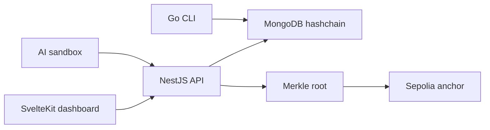

# Presentation Deck

Use this as the structure for a 6-8 slide company or incubator presentation.

## Slide 1: Ernest

AI provenance and blockchain anchoring PoC.

Key message:

- Ernest records tamper-evident AI lifecycle and inference evidence.
- It stores hashes and metadata, not raw sensitive AI data.
- It is an alpha PoC for demos, technical evaluation, and incubation.

Speaker note:

Position Ernest as a focused provenance layer, not a replacement for model registries, data platforms, or compliance tools.

## Slide 2: Problem

AI systems increasingly need audit answers:

- Which model version produced this output?
- What metadata, metrics, and artifact hash were registered?
- Has the event history been tampered with?
- Can evidence be externally timestamped without publishing private data?

Speaker note:

The problem is not only storage. It is trustable evidence that can be verified later.

## Slide 3: Proposed Solution

Ernest adds a small provenance control plane:

- Register model lifecycle events.
- Log inference events as input/output hashes.
- Append events to a MongoDB-backed hashchain.
- Verify local chain integrity.
- Optionally anchor Merkle roots to Sepolia.

Speaker note:

Keep this slide simple: hash-only evidence, local verification, optional public proof.

## Slide 4: Architecture

Core components:

- SvelteKit dashboard.
- NestJS API.
- MongoDB hashchain.
- Optional Sepolia smart contract.
- Go CLI, Audit Readiness review, and optional sandbox tools.
- Optional MLflow demo stack for train-to-audit evidence flow.
- Docker Compose deployment with optional GHCR images.

Speaker note:

Explain that source systems keep raw data; Ernest stores proof material.

## Slide 5: Demo Flow

Show:

1. Run MLflow Iris demo or register a model manually.
2. Log inference.
3. View provenance.
4. Run Audit Readiness and export an evidence packet.
5. Verify chain.
6. Show API docs.
7. Optional: anchor root.

Speaker note:

Use `docs/demo-script.md` as the detailed runbook. Keep the live demo short and controlled.

## Slide 6: Security And Limits

Current controls:

- API key for public demo write endpoints.
- CORS restriction.
- Private MongoDB on Docker network.
- Hashchain verification.
- Optional Sepolia low-fund wallet.

Current limits:

- No full auth/RBAC yet.
- No formal tenant isolation yet.
- Clients can submit false hashes unless submissions are signed.
- Not a production compliance system.

Speaker note:

This slide builds credibility. Be explicit about what alpha does not solve yet.

## Slide 7: Incubation Roadmap

Next milestones:

- Enterprise identity with OIDC/JWT.
- RBAC and tenant-aware authorization.
- Signed client submissions.
- Integration with a real model registry or inference event stream.
- Metrics, backups, audit logs, and evidence exports.
- Private browser-local audit assistance with WebLLM.

Speaker note:

Turn gaps into an engineering roadmap with clear enterprise value.

## Slide 8: Ask

Suggested ask for an IT company:

- Technical feedback from platform/security teams.
- One sponsor use case with synthetic or non-sensitive data.
- Access to a model registry or inference event stream for integration.
- Agreement on pilot success metrics.

Pilot success metrics:

- Register external model events.
- Retrieve evidence for a model/inference.
- Verify hashchain after backup/restore.
- Produce an audit-friendly evidence export.
