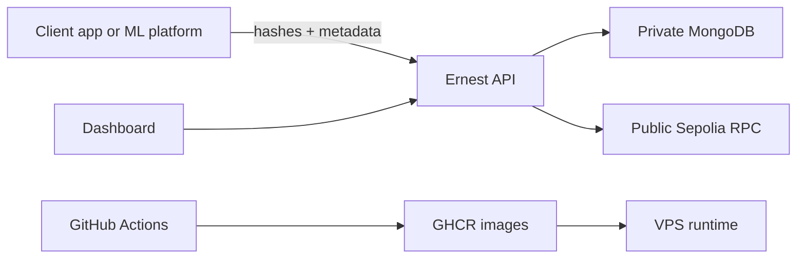

# Threat Model

This threat model covers the alpha PoC and highlights what must change before enterprise production use.

## Assets

- Provenance blocks and model metadata in MongoDB.
- API key used for protected write endpoints.
- Sepolia private key and RPC credentials.
- GHCR images and deployment compose files.
- Hash evidence submitted by client systems.
- Public Merkle roots and anchor metadata.

## Trust Boundaries

## Current Mitigations

- Write endpoints can require `X-Ernest-Api-Key`.
- MongoDB is intended to remain private on the Docker network.
- CORS can be restricted with `CORS_ORIGIN`.
- Hashchain verification recomputes SHA-256 hashes and `previousHash` links.
- Duplicate-key retries reduce append races in low-throughput demos.
- Docker Compose binds service ports to localhost for reverse-proxy deployment.
- Sepolia keys are documented as demo-only, low-fund credentials.

## Threats And Gaps

| Threat | Current State | Recommended Next Control |
| --- | --- | --- |
| Client submits false hashes | Not prevented | Signed submissions and trusted client identities |
| API key leaks from browser demo | Documented public value | Server-side write proxy or user/session auth |
| Unauthorized write access | Shared API key only | OIDC/JWT, mTLS, RBAC, rate limits |
| MongoDB compromise | Private network assumption | Managed DB controls, backups, encryption, least privilege |
| Hashchain append race under load | Duplicate-key retry | Transactional append, queue, or dedicated event log |
| Sepolia private key leak | Environment variable guidance | Secrets manager, signer service, approval workflow |
| Replay or duplicate submissions | Partial duplicate handling | Idempotency keys and signed event timestamps |
| Malicious image or supply-chain drift | CI and GHCR publishing | SBOM, image signing, provenance attestations |
| Sensitive data in metadata | Caller responsibility | Metadata schema review and data-loss-prevention checks |
| Tenant data mixing | Demo org scoping only | Formal tenant model and authorization checks |

## Pilot Review Checklist

- Decide whether browser-origin writes are allowed in the pilot.
- Define which systems are trusted to compute hashes.
- Define metadata fields and ban sensitive values.
- Keep MongoDB private and test backup restore.
- Store Sepolia or future chain keys outside `.env` for non-demo use.
- Review GHCR package visibility and deploy token scope.
- Run `pnpm run audit:prod` and review `pnpm run audit:all` before release.
