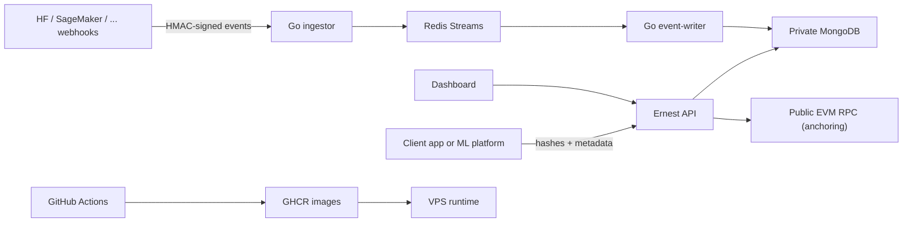

# Ernest Threat Model

Ernest is **tamper-evident, not tamper-proof**. This document states precisely what that
means: which manipulations Ernest detects, which it cannot prevent, what each guarantee
rests on, and what an operator must do to keep those guarantees meaningful. If you are
evaluating Ernest for compliance or audit use, read this first.

## What Ernest is

A per-organization, on-premises provenance ledger. Each deployment runs its own Ernest
instance and its own MongoDB; there is no shared or global chain. Model registrations and
inference events are stored as blocks in a **hashchain** (each block's hash covers its
content and the previous block's hash), and the chain is periodically **anchored** by
publishing a Merkle root of block hashes to an external Ethereum contract
(`ErnestMerkleAnchor`). Ernest is not itself a blockchain: there is no consensus, no
distributed replication, and a single writer domain. The external anchor is what turns
"our database says so" into "we can prove this existed before time T to someone who does
not trust our database".

## Assets

- Provenance blocks and model metadata in MongoDB.
- Access credentials: `ERNEST_API_KEY` (read-write), `ERNEST_READ_API_KEY` (read-only),
  and named access tokens issued via `/api/auth/tokens` (stored SHA-256-hashed).
- Anchor wallet private key and RPC credentials.
- Hash evidence submitted by client systems.
- Public Merkle roots and anchor metadata (once published, these protect the history).
- GHCR images and deployment compose files.

## Trust boundaries

| Actor | Access | Trusted with |
|---|---|---|
| ML engineers / apps | Read-write credential | Writing truthful events at creation time |
| External auditors | Read-only key or named expiring token | Nothing — they verify |
| Ernest operator (root on host, Mongo admin) | Everything except the anchored history | The window between anchors |
| Holder of the anchor wallet key | Publishing new anchors | Not the existing ones |

## Guarantees, and what each rests on

**G1 — Internal consistency.** Any modification, deletion or reordering of an existing
block breaks the hash linkage and is detected by `/api/verify`, the hourly scheduled
integrity check (which POSTs to `WEBHOOK_URL` on failure), and the independent CLI
verifier. Rests on: SHA-256 and the cross-language canonicalization contract pinned by
`testdata/hash-golden-vectors.json`.

**G2 — Existence before anchor time.** Once a Merkle root covering block N is confirmed
on-chain, no one — including the operator — can fabricate a different history up to N
that matches the published root. Rests on: the external chain's immutability and hash
collision resistance. This is Ernest's strongest guarantee.

**G3 — Content privacy.** Blocks store hashes of inference inputs/outputs, not the data
itself. A leaked database does not leak training or inference content. Rests on:
callers actually sending hashes, which the API shape encourages but cannot enforce.

**G4 — Write/read separation.** A read-only credential or token cannot write or manage
credentials; token revocation takes effect immediately; tokens are hashed at rest.

## What Ernest does NOT guarantee

**N1 — The pre-anchor window is rewritable by the operator.** Whoever controls MongoDB
can drop the tail of the chain and regenerate a clean-looking history for every block
not yet covered by a confirmed anchor. With `ANCHOR_EVERY_N_BLOCKS=50`, that window is
up to 50 blocks plus confirmation time. Shrinking it costs anchor-transaction fees; the
trade-off is the operator's to tune. Deleting the entire database is detectable by
absence (published anchors reference roots the new history cannot reproduce) but not
recoverable — see [backup-recovery.md](backup-recovery.md).

**N2 — Garbage in, garbage forever.** Ernest proves an event was recorded at a point in
time and not altered since. It cannot prove the event was *true*. A model registered
with a falsified accuracy metric is preserved with perfect integrity. Provenance is
evidence of process, not of honesty at the source.

**N3 — Timestamps are claims, not proofs.** Block timestamps come from the writing
host's clock. Monotonicity is enforced (a block never carries a timestamp earlier than
its predecessor's) and the block index is the authoritative order, but the wall-clock
value is only as good as the host's NTP discipline. The cryptographic time bound is the
anchor: "before the anchor's on-chain timestamp", nothing finer.

**N4 — Availability.** Nothing in the design resists deletion or denial of service.
Scheduled backups are the mitigation; a restored backup is itself verifiable against
the chain and past anchors.

**N5 — Credential theft.** Keys and tokens travel as bearer headers. TLS termination,
rotation, and scoping auditors to expiring read-only tokens are the operator's
responsibility.

## Attack scenarios, explicitly

| Scenario | Outcome |
|---|---|
| Operator edits one historical block in Mongo | Detected (G1): next verify fails, webhook fires within the hour |
| Operator rewrites the unanchored tail *and* recomputes all hashes | Undetected internally if done perfectly, **unless** an anchor already covered it (G2). This is the N1 window |
| Operator deletes the whole database and re-seeds | New chain verifies internally, but published anchors expose the rewrite to anyone who checks |
| Client submits false hashes / fake metrics | Recorded faithfully; N2 — Ernest is not a lie detector |
| Auditor's read-only token leaks | Reads exposed until revoked (immediate effect); no write or admin capability attached |
| Provider webhook replayed | Rejected: HMAC timestamp tolerance (`PROVIDER_HMAC_TOLERANCE_SECONDS`) plus per-event dedup index |
| Host clock set back before writing | Order preserved (index + monotonic timestamps); wall-clock claim wrong until the next anchor bounds it (N3) |
| Anchor wallet key leaks | Attacker can publish *new* anchors (noise, gas cost), cannot alter existing ones; rotate the wallet and note the cutover anchor |

## Operator obligations

The guarantees hold only if the deployment does its part:

1. **Anchoring must actually run** (`INFURA_URL`, `PRIVATE_KEY`, `CONTRACT_ADDRESS`).
   Without it, G2 evaporates and N1 becomes "the operator can rewrite everything,
   always".
2. **Set `WEBHOOK_URL`** so integrity failures page someone instead of waiting in
   `/health` for a viewer.
3. **Configure access keys.** With neither key set the instance is open — demos only.
4. **Back up on a schedule and test restores** ([backup-recovery.md](backup-recovery.md)).
5. **Keep NTP disciplined** on the writing host if timestamps matter beyond anchor
   bounds.
6. **One Ernest deployment per MongoDB.** Within a deployment, concurrent writers are
   safe (unique block index serializes appends); the design still assumes a single
   instance owns the database.

## Known gaps before enterprise production

| Threat | Current state | Recommended next control |
| --- | --- | --- |
| Client identity on writes | Shared write key or issued tokens | Signed submissions / OIDC per-client identity |
| Browser demo key exposure | `PUBLIC_ERNEST_API_KEY` documented as public | Session auth or server-side write proxy |
| Anchor key custody | Environment variable | Secrets manager or external signer service |
| Supply-chain drift | CI + GHCR publishing | Image signing, SBOM, provenance attestations |
| Sensitive data in metadata | Caller responsibility | Metadata schema validation / DLP checks |
| CLI verification transport | Direct MongoDB connection | Read-only API or exported-dump verification |
| Large-integer fidelity | int64 beyond 2^53 diverges between JS and Go verifiers | Reject or stringify >2^53 integers at ingest |

## Out of scope

Side-channel resistance, malicious modification of the Ernest binaries themselves
(verify releases against the repository), compromise of the underlying EVM network, and
legal admissibility of the evidence in any jurisdiction.
